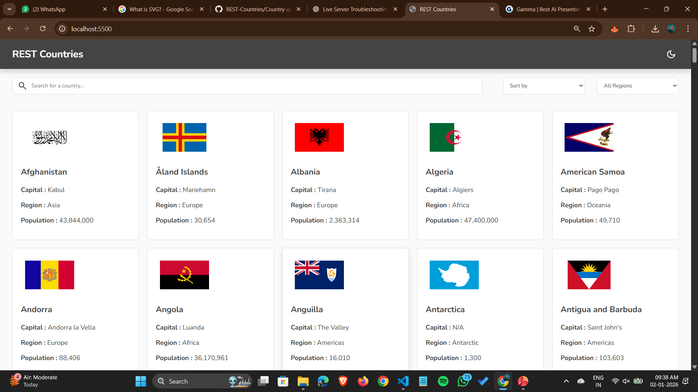
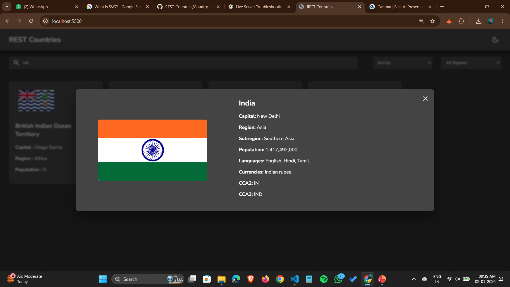

🌍 Country Explorer Web App

A simple and interactive web application that displays country details using data from a JSON file. Users can explore countries, view key information, and enjoy a clean UI with light and dark mode support.

🚀 Features
  
  🌎 Display country information
  
  🔍 Search countries
  
  🌐 Filter by region
  
  🌓 Light & Dark mode toggle
  
  ⚡ Fast and responsive UI

🛠️ Tech Stack

  HTML5
  
  CSS3
  
  JavaScript

📁 Project Structure
  Country-api/
  │
  |__ ScreenShots
  |      |__ HomePage.png
  |      |__ HomePage2.png
  |      |__ CountryDetails.png
  ├── index.html        # Main HTML file
  ├── header.html       # Header component
  ├── style.css         # Styling
  ├── script.js         # JavaScript logic
  ├── data.json         # Country data
  ├── dark_mode.svg     # Dark mode icon
  └── light_mode.svg    # Light mode icon

▶️ How to Run the Project
✅ Method 1: Using Live Server (Recommended)

Open the project folder in VS Code

Install Live Server extension (if not already installed)

Right-click on index.html

Click "Open with Live Server"

Your project will open automatically in the browser 🚀

✅ Method 2: Open Manually

Just double-click index.html
(Some features may not work fully due to browser restrictions.)

🧠 How It Works

Country data is fetched from data.json

JavaScript dynamically renders:

Country cards

Search results

Filtered regions

Theme switching is handled using CSS + JavaScri

📸 Screenshots

